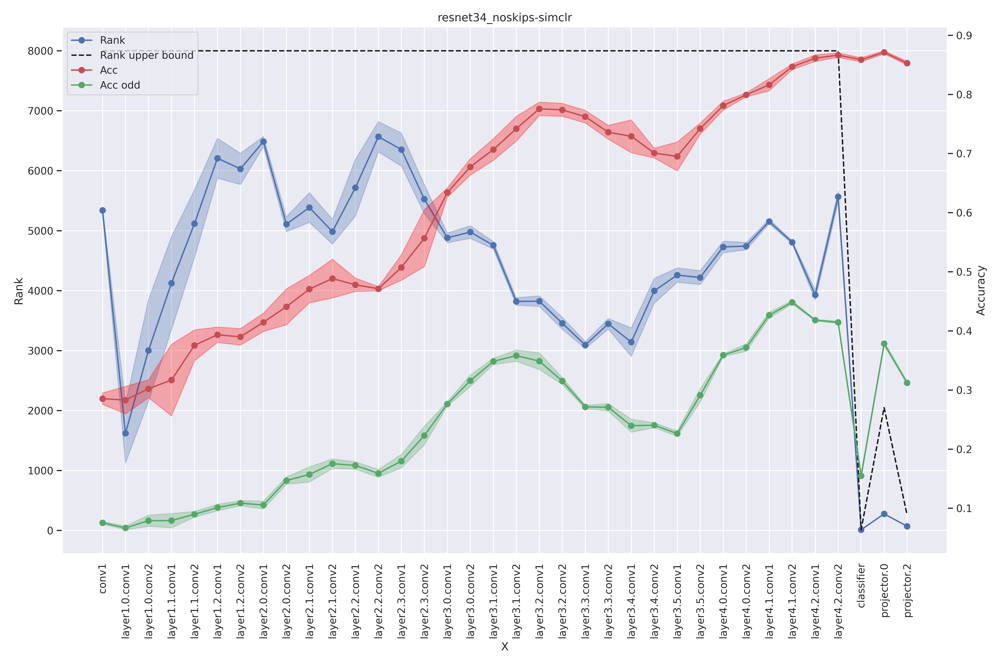
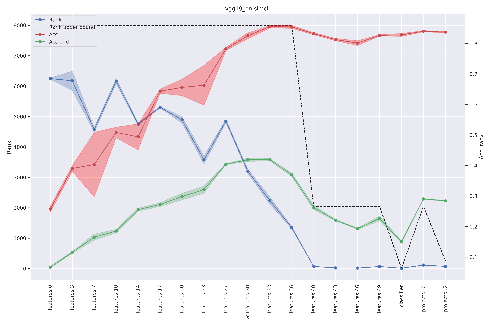

<!-- 
_class: lead invert
_paginate: false
 -->
<style>
section { 
    font-size: 20px; 
}
img[alt~="center"] {
  display: block;
  margin: 0 auto;
}
</style>
<style scoped>section { font-size: 30px; }</style>

# Raport 
Analiza metod barlow twins oraz simclr

**Piotr Hondra**
24/09/2023

---
<!-- footer: 'Piotr Hondra | 24/09/2023' -->
# Informacje wstępne
Domyślnie każdy resnet był modyfikowany w sposób poniższy chyba, że zaznaczono inaczej:

```python
self.backbone.conv1 = nn.Conv2d(
                    3, 64, kernel_size=3, stride=1, padding=2, bias=False
                )
self.backbone.maxpool = nn.Identity()
```
Eksperymenty dzieliły się na:
- Resnet34
- Resnet34 bez połączeń rezydulanych
- Resnet34 bez połączeń rezydulanych oraz bez powyższych modyfikacji
- Vgg19 z normalizacją pakietową

**NOTKA:** Każdy przebieg składa się z odcinków połączonych kropką oraz zacieniowanych granic wokół. Kropkami jest oznaczona średnia z każdego z 3 pomiarów pojedynczego eksperymentu. Granice wskazują na odchylenie standardowe.

---
# Barlow Twins
---
# Resnet34


---
# Resnet34 bez połączeń rezydualnych


---
# Resnet34 bez połączeń rezydualnych oraz modyfikacji


---
# Vgg19 BN


---
# SimCLR
---
# Resnet34


---
# Resnet34 bez połączeń rezydualnych


---
# Resnet34 bez połączeń rezydualnych oraz modyfikacji


---
# Vgg19 BN
