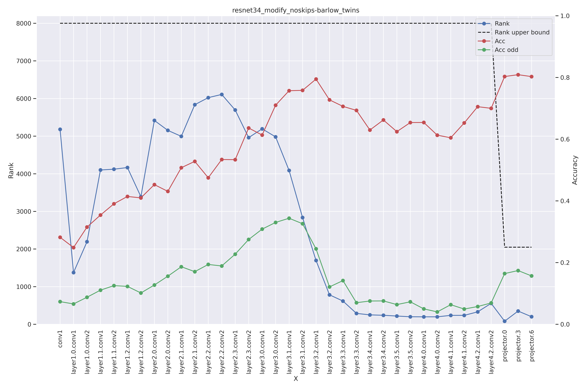

<!-- 
_class: lead invert
_paginate: false
-->


<style>
  section { 
      font-size: 20px; 
  }
  img[alt~="center"] {
    display: block;
    margin: 0 auto;
}
</style>
<style scoped>section { font-size: 30px; }</style>

# Raport 
Analiza metod barlow twins oraz simclr dla Resnet34 (no)?(modify|skips)

**Piotr Hondra**
30/09/2023

---
<!-- footer: 'Piotr Hondra | 30/09/2023' -->
# Informacje wstępne
Modyfikacja Resnet34:

```python
self.backbone.conv1 = nn.Conv2d(
                    3, 64, kernel_size=3, stride=1, padding=2, bias=False
                )
self.backbone.maxpool = nn.Identity()
```
Eksperymenty dzieliły się na:
- Resnet34 bez połączeń rezydulanych z modyfikacjami
- Resnet34 bez połączeń rezydulanych bez modyfikacji
- Resnet34 z połączeniam rezydulanymi z modyfikacjami
- Resnet34 z połączeniam rezydulanymi bez modyfikacjami

**NOTKA:** Resnet34 bez połączeń rezydulanych bez modyfikacji wypadał znacząco gorzej podczas treningu dla obu metod.

---
<!-- _class: lead -->

# Barlow Twins

---
# Resnet34 nomodify skips


---
# Resnet34 modify skips


---
# Resnet34 modify noskips


---
# Resnet34 nomodify noskips


---
<!-- _class: lead -->

# SimCLR
---
# Resnet34 nomodify skips


---
# Resnet34 modify skips


---
# Resnet34 modify noskips


---
# Resnet34 nomodify noskips
