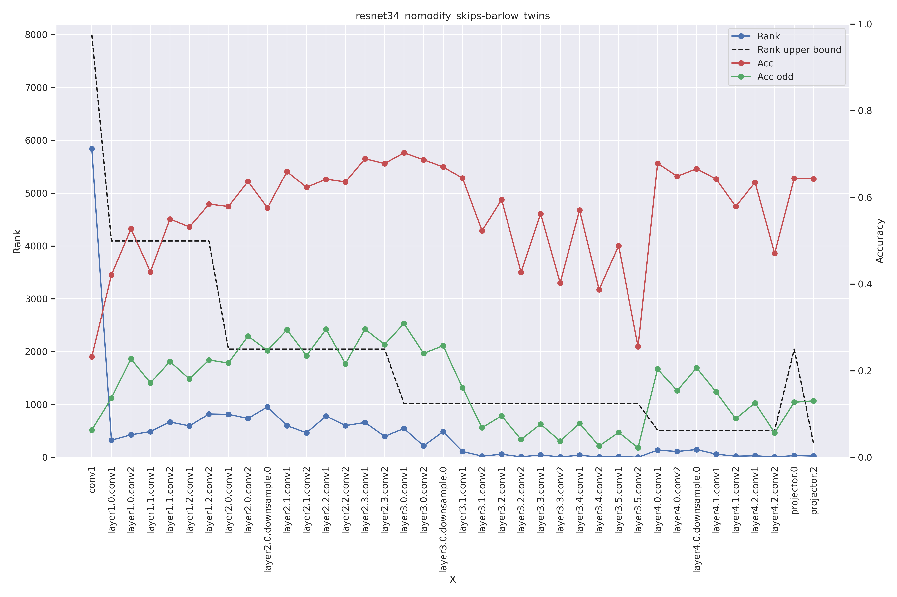
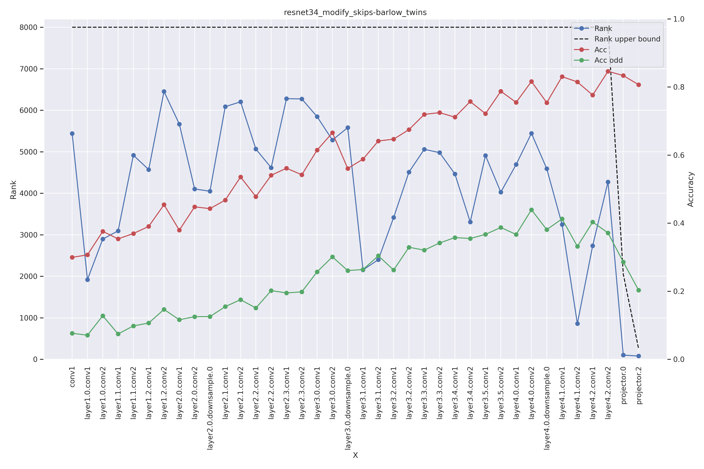
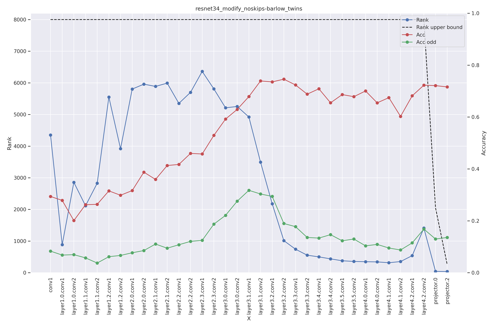
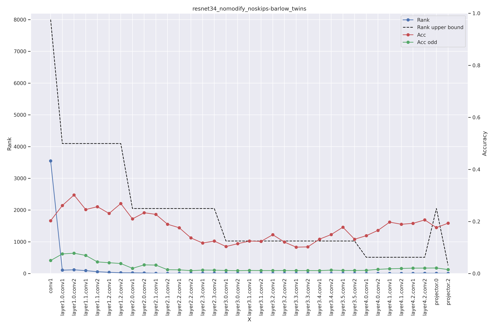
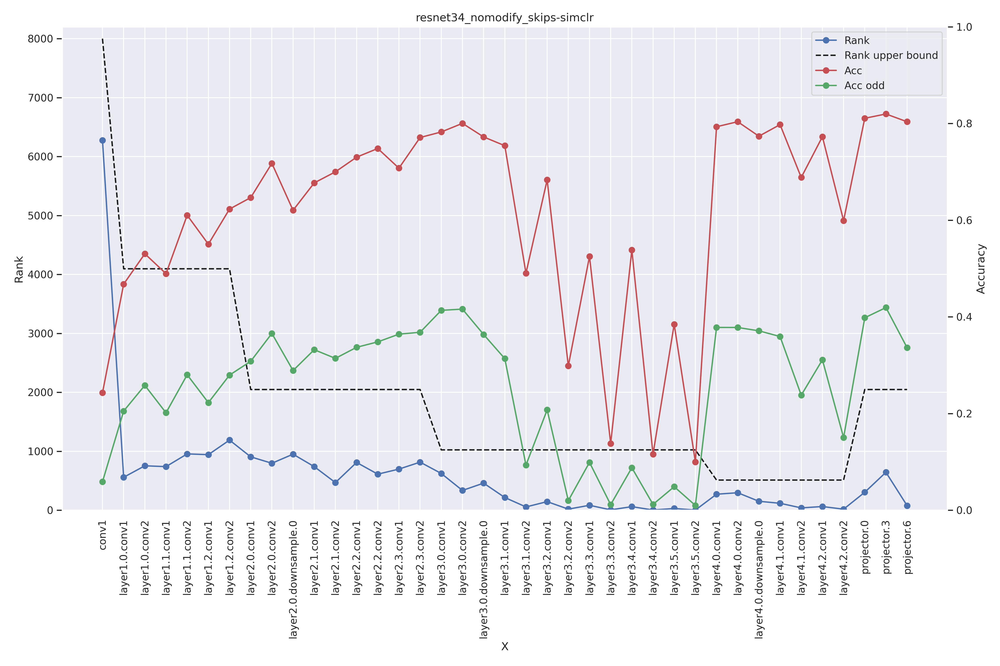
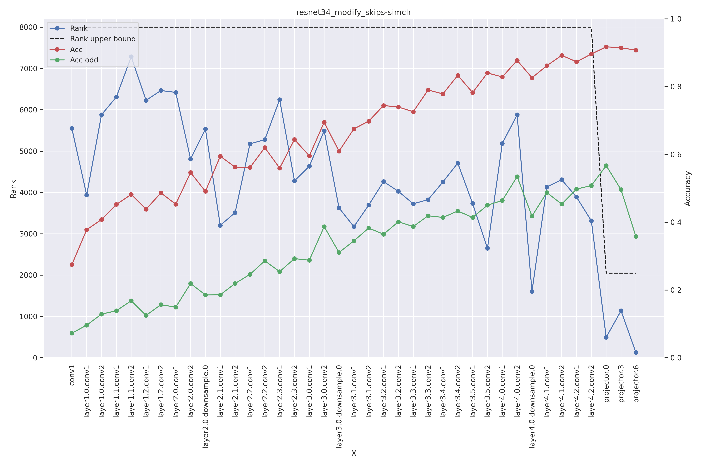
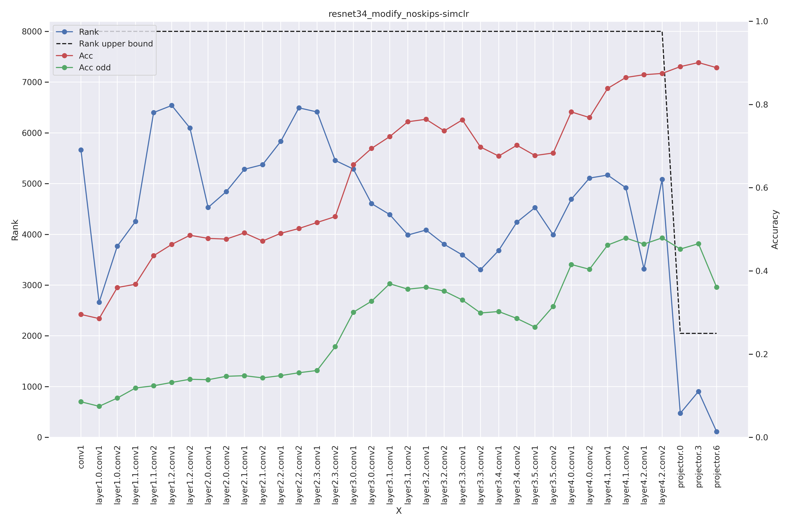
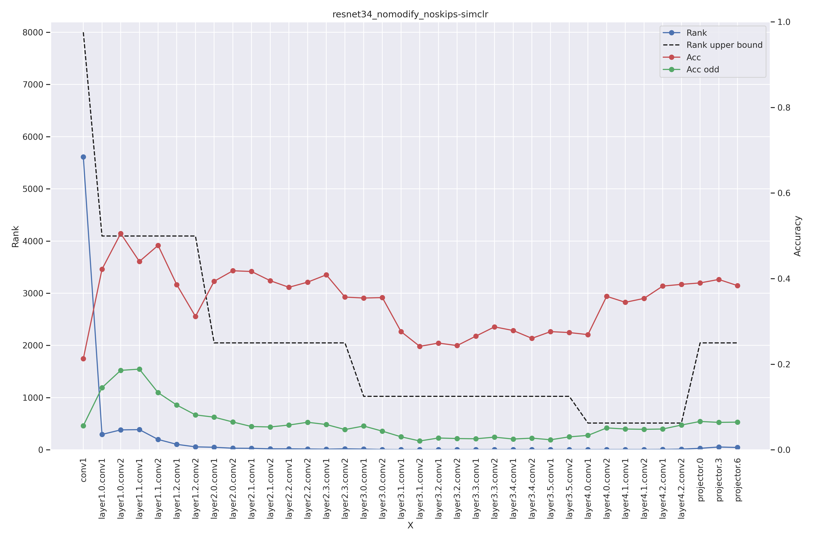

<!-- 
_class: lead invert
_paginate: false
-->

# Raport 
Analiza metod barlow twins oraz simclr dla Resnet34 (no)?(modify|skips) z zamianą augmentcji oraz projektora

**Piotr Hondra**
10/10/2023

---
<!-- footer: 'Piotr Hondra | 10/10/2023' -->
# Informacje wstępne
Eksperymenty polegały na zamianie projektora oraz augmentcji dla metod barlow twins oraz simclr

Eksperymenty dzieliły się na:
- Resnet34 bez połączeń rezydulanych z modyfikacjami
- Resnet34 bez połączeń rezydulanych bez modyfikacji
- Resnet34 z połączeniam rezydulanymi z modyfikacjami
- Resnet34 z połączeniam rezydulanymi bez modyfikacjami

---
<!-- _class: lead -->
<!-- footer: ' Barlow Twins | Piotr Hondra | 10/10/2023' -->

# Barlow Twins

---
# Resnet34 nomodify skips

---
# Resnet34 modify skips

---
# Resnet34 modify noskips

---
# Resnet34 nomodify noskips

---
<!-- _class: lead -->
<!-- footer: ' SimCLR | Piotr Hondra | 10/10/2023' -->

# SimCLR
---

# Resnet34 nomodify skips

---
# Resnet34 modify skips

---
# Resnet34 modify noskips

---
# Resnet34 nomodify noskips
